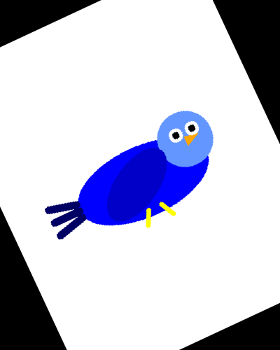
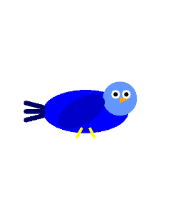
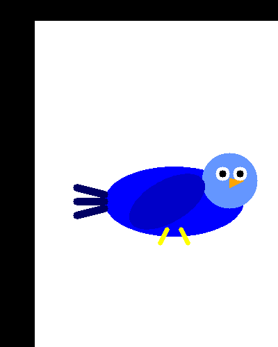
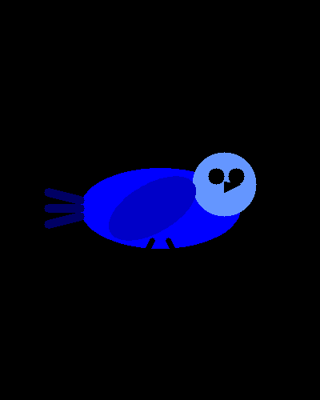
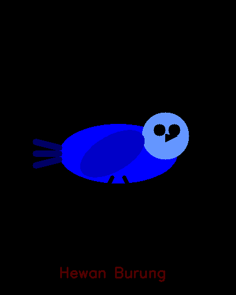

# UTS_PAKJEHAN
membuat character 

Muhamad maulana/43050230011

deskripsi karakter:
burung (manuk) yang terispirasi dari logo twiter versi lama, dimana memiliki benruk yang sederhana dan mudah dibuat di Opencv dengan menggabungkan beberapa bentuk seperti untuk membuat badan menggunakan bentuk oval berwarna biru, ekor dengan 3 garis berwarna biru kehitaman, kaki dengan 2 garis berwarna kuning, sayap berbentuk oval berwarna biru tua, paruh bentuk setitiga berwarna orange dan sepasang mata berbentuk bulat dengan pupil berwarna hitam.

Screenshot

